# Criação e Utilização de Recurso de IA no Azure

Este documento fornece um guia detalhado para a criação e utilização de um recurso de Inteligência Artificial (IA) no Azure, focado na análise de áudio e texto. Inclui um passo a passo completo, com imagens e exemplos para facilitar a compreensão do processo.

---

## Estrutura de Pastas e Arquivos

```
.
├── inputs
│   └── sentencas.txt
├── images
│   ├── criando-speech-resource.png
│   ├── selecionando-speech-resource.png
│   ├── speech-resource.png
│   ├── usando-resource.png
│   ├── selecionando-real-time-speech-to-text.png
│   ├── inserindo-audio.png
│   ├── transcricao-audio.png
│   ├── segundo-teste-da-trancricao-de-outro-audio.png
│   ├── language-studio-hub.png
│   ├── selecionando-o-analyze-sentiment-and-mine-options.png
│   ├── analyze-sentiment-and-mine-options.png
│   ├── texto-colocado-como-teste-analyze-no-sentiment-and-mine-options.png
│   ├── analyze-sentiment-and-mine-options-hub.png
└── readme.md
```

- **Pasta `inputs/`**: Contém o arquivo de texto com as sentenças a serem analisadas.
- **Pasta `images/`**: Armazena as capturas de tela de cada etapa do processo.
- **Arquivo `readme.md`**: Este documento, que detalha o procedimento de configuração e utilização do recurso de IA.

---

## 1. Criação do Recurso de Speech no Azure

### 1.1 Criando o Recurso no Portal Azure
> **Imagem:**  
> 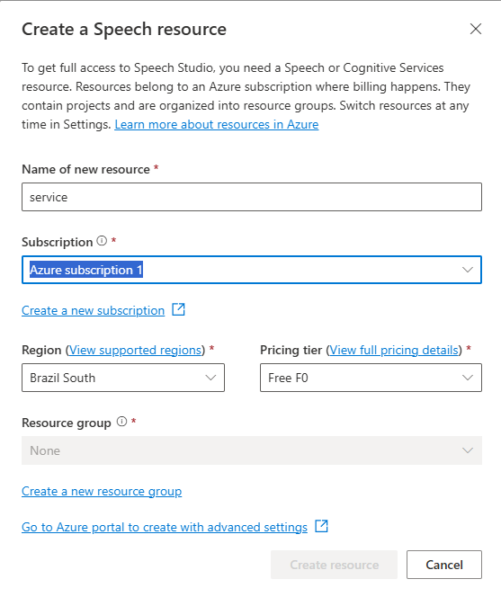

- Acesse o [Portal Azure](https://portal.azure.com) e inicie a criação de um recurso de *Speech*.

### 1.2 Selecionando o Tipo de Recurso
> **Imagem:**  
> 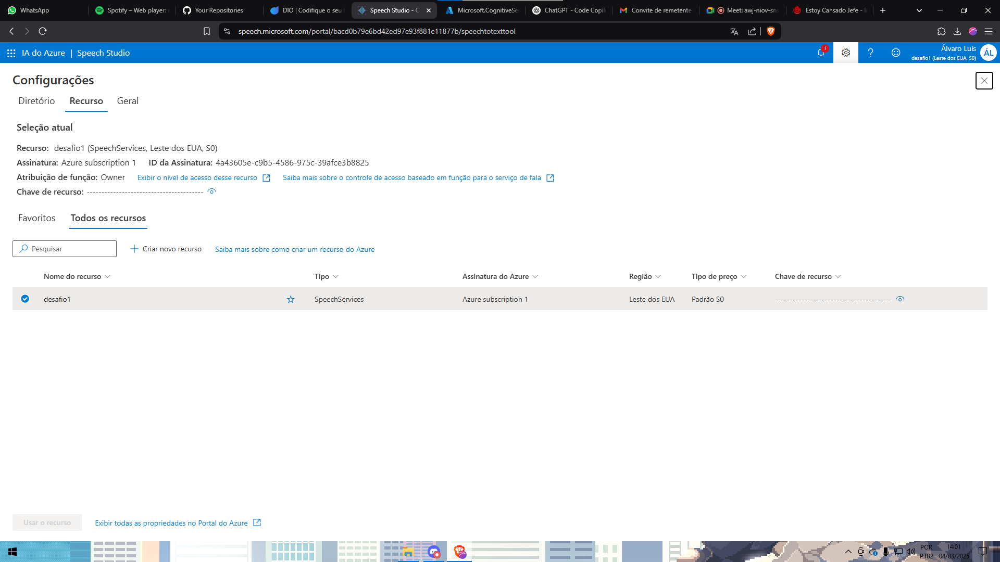

- Escolha o serviço de *Speech* entre as opções disponíveis.

### 1.3 Visualizando os Detalhes do Recurso
> **Imagem:**  
> 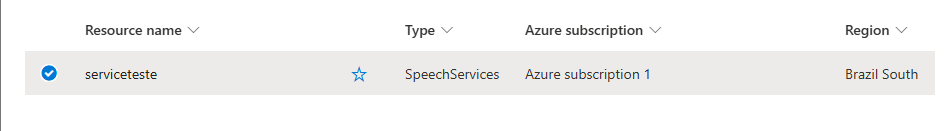

- Verifique as informações e configurações do recurso criado.

### 1.4 Utilizando o Recurso
> **Imagem:**  
> 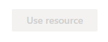

- Explore as funcionalidades do recurso, incluindo a chave de acesso (*key*) e o *endpoint* para integração com aplicações.

---

## 2. Configuração para Transcrição de Áudio

### 2.1 Selecionando Real-Time Speech-to-Text
> **Imagem:**  
> 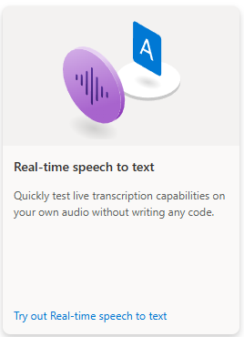

- Configure o serviço para transcrição de áudio em tempo real.

### 2.2 Inserindo o Áudio para Transcrição
> **Imagem:**  
> 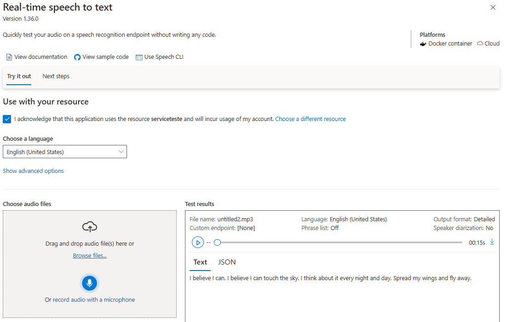

- Carregue um arquivo de áudio para conversão em texto.

### 2.3 Exibindo a Transcrição do Áudio
> **Imagem:**  
> 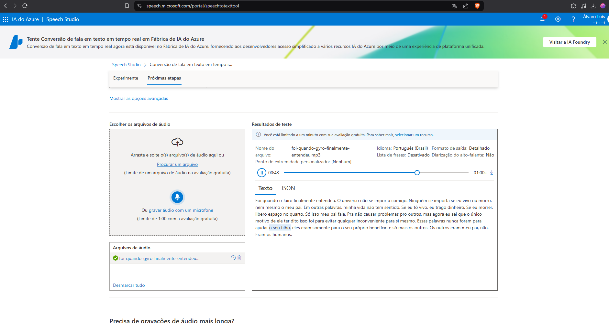

- Visualize o resultado da transcrição.

### 2.4 Teste Adicional de Transcrição
> **Imagem:**  
> 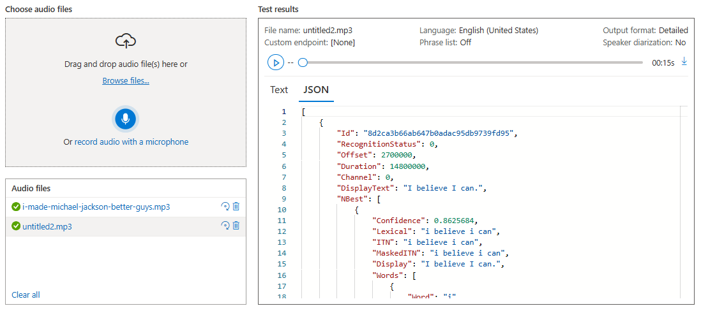

- Execute um segundo teste para avaliar a precisão.

---

## 3. Análise de Texto e Sentimento

### 3.1 Acessando o Language Studio Hub
> **Imagem:**  
> 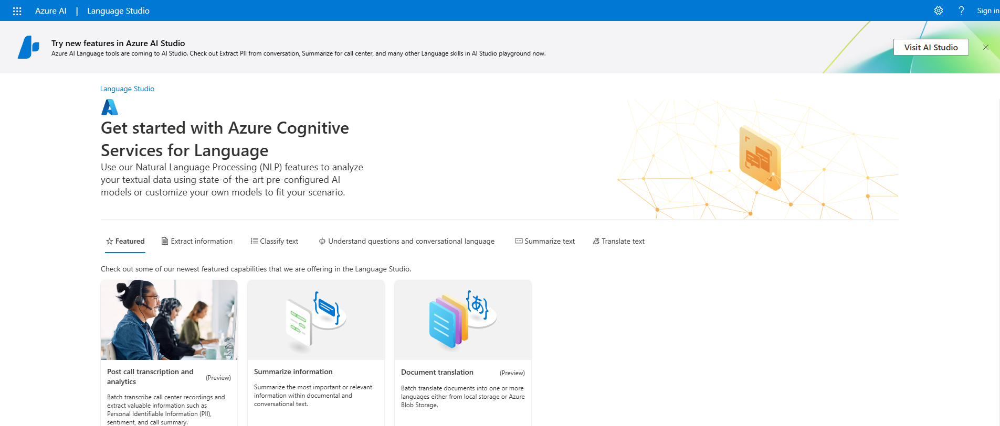

- Navegue até o *Language Studio Hub* para testar funcionalidades de análise de texto.

### 3.2 Selecionando a Opção de Análise de Sentimento
> **Imagem:**  
> 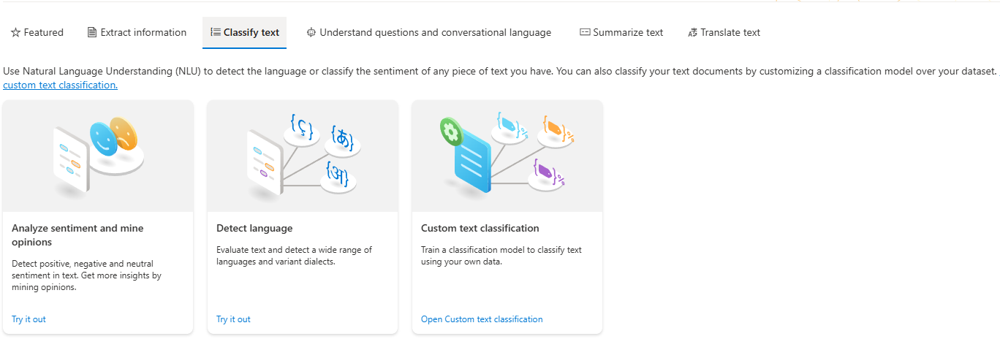

- Escolha a opção de análise de sentimento.

### 3.3 Visualizando a Análise
> **Imagem:**  
> 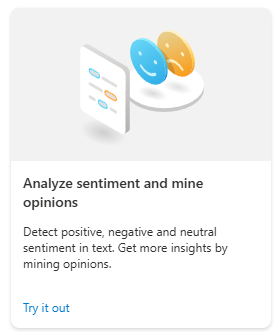

- Confira os resultados da análise aplicada ao texto.

### 3.4 Testando com um Texto de Exemplo
> **Imagem:**  
> 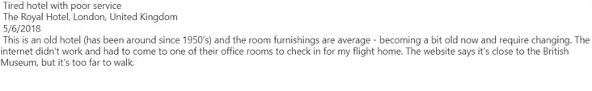

- Utilize um texto de teste para validar a configuração.

### 3.5 Explorando o Hub de Análise
> **Imagem:**  
> 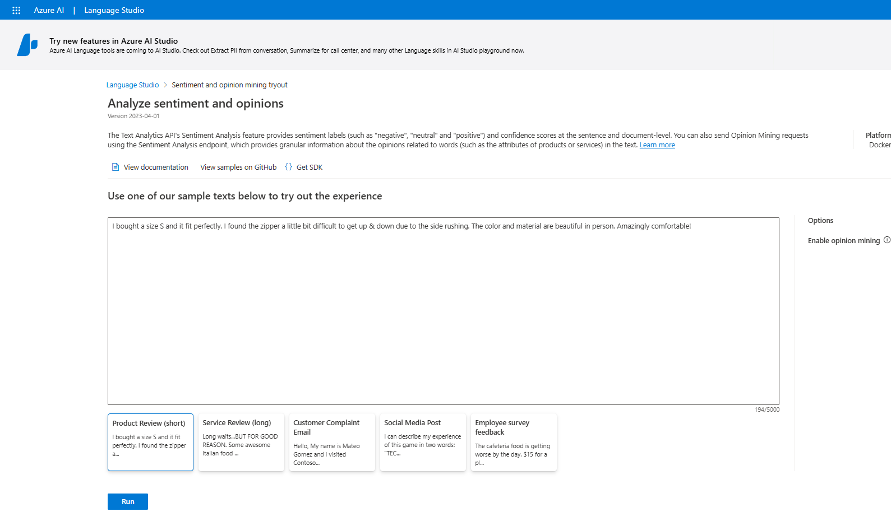

- Acesse outras funcionalidades do hub de análise de sentimento.

---

## 4. Criação do Arquivo de Sentenças

Na pasta `inputs`, crie um arquivo de texto `sentencas.txt` com frases para análise.  
**Exemplo:**

```
Esta é a primeira sentença de teste.
Eu gosto de aprender novas tecnologias.
Estou animado para testar este serviço de IA.
```

---

## Considerações Finais e Próximos Passos

### Insights Obtidos:
- **Integração Facilitada:** Configuração rápida para uso em aplicações.
- **Transcrição e Análise:** Conversão de áudio em texto e identificação de sentimentos.
- **Escalabilidade:** Personalização para diferentes cenários e projetos.

### Próximos Passos:
- Testar diferentes áudios e textos.
- Explorar outras funcionalidades do Azure Cognitive Services.
- Integrar os resultados em aplicações web ou chatbots.

> **Nota:** Certifique-se de que os nomes dos arquivos de imagem estão corretos para que sejam exibidos no documento.

